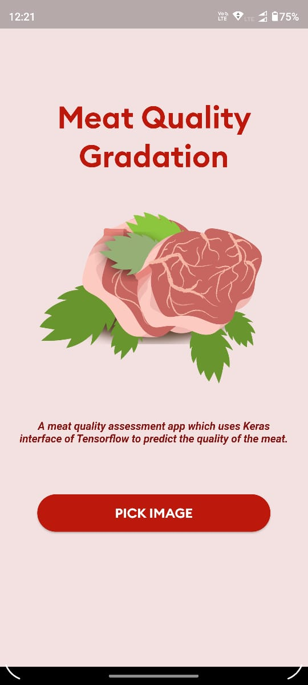
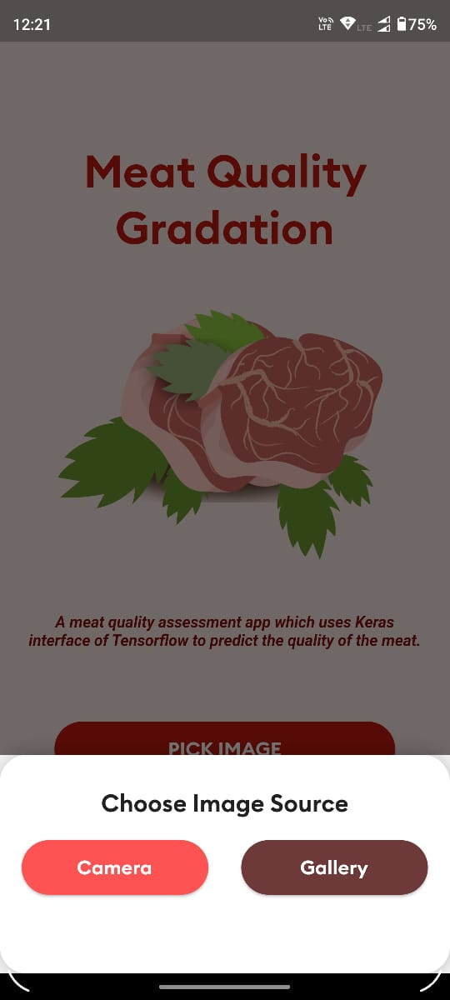
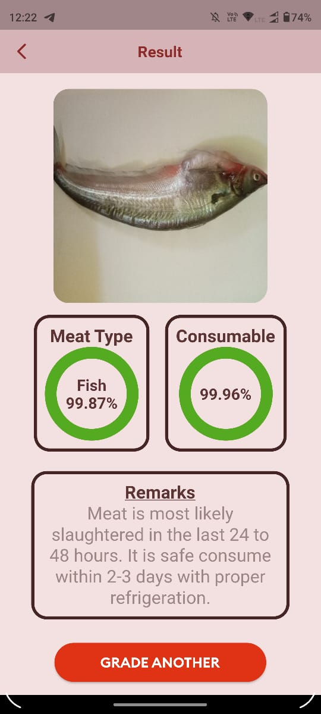
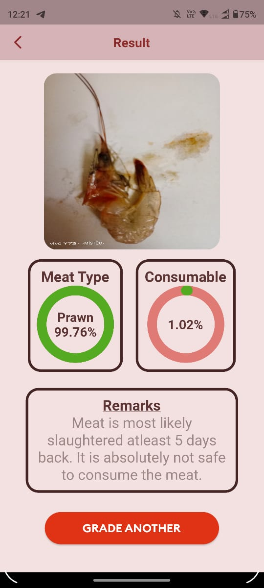

## Meat Gradation App
A meat quality assessment app made using Flutter which uses Keras interface of Tensorflow to predict the quality of the meat (Fish, Chicken and Prawn).

### Screenshots
  
  
