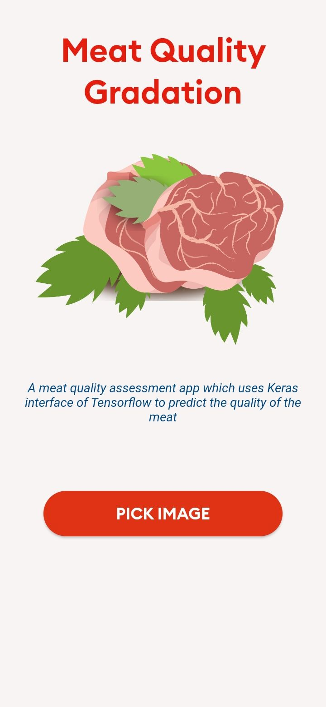

## Meat Quality Gradation Research Project
This is the final year research project of Computer Science Engineering batch of 2023 of Govt. College of Engineering and Ceramic Technology.

### Name of the students - 
1. Arunima Chaudhuri (GCECTB-R19-3008)
2. Debdoot Roy Chowdhury GCECTB-R19-3014)
3. Bidesh Banerjee (GCECTB-R19-3013)
4. Shubhodeep Chanda (GCECTB-R19-3026)

### Name of the supervisor - 
1. Dr. Kingshuk Chatterjee

### Screenshots
  
  
